# Realtime-FPGA-Video-Filter

A realtime video filter on FPGA Nexys4.

[TOC]

## 实验简介

本实验作为 `嵌入式系统设计方法` 课程的大作业, 利用了 FPGA 的高并行性质来进行视频流处理, 利用了`均值滤波`, `中值滤波`, `灰度化`(及`反灰度化`)等技术来处理图像, 并最终产生`图像边沿检测`结果.

## 实验环境

- EDA 工具: Vivado 2020.2
- 实验平台: Windows 10
- 实验设备: Nexys 4 DDR xc7a100tcsg324-1 及 OV7670 摄像头

## 工程结构

我们使用了像素流水线的方式组织图像的处理。OV 7670 capture module每次给出一个像素的颜色数据，通过各级流水线的图像处理算法可以对这个像素数据进行一定的处理，并将这个像素数据送入SRAM储存，最终通过VGA显示模块显示在显示器上。通过各级流水线前的MUX，可以很方便地选择数据通过的模块。

通过像素流水线可以最大程度的复用各种模块（例如Sobel模块需要灰度模块的预处理才能使用），这样有利于节约FPGA资源；并且通过像素流水线可以很方便地关闭和使用某个图像处理模块，从而便于对比每个图像处理算法的效果。

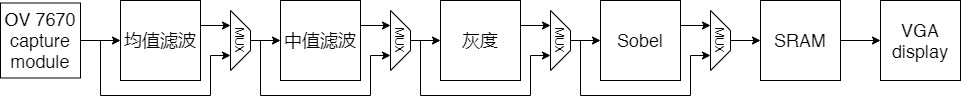

## 算法原理及实现

### 摄像机配置

实验中我们采用 OV7670 摄像头, 它的工作电压低，提供单片 VGA 摄像头和影像处理器的所有功能. 通过 SCCB 总线控制, 可以输出整帧, 子采
样, 取窗口等方式的各种分辨率 8 位影响数据. 此外该产品 VGA 图像最高达到 30 帧/秒, 高于人眼可分辨频率. 另外, 这一款 OV7670 也能够同时兼容 I2C 协议来进行控制.
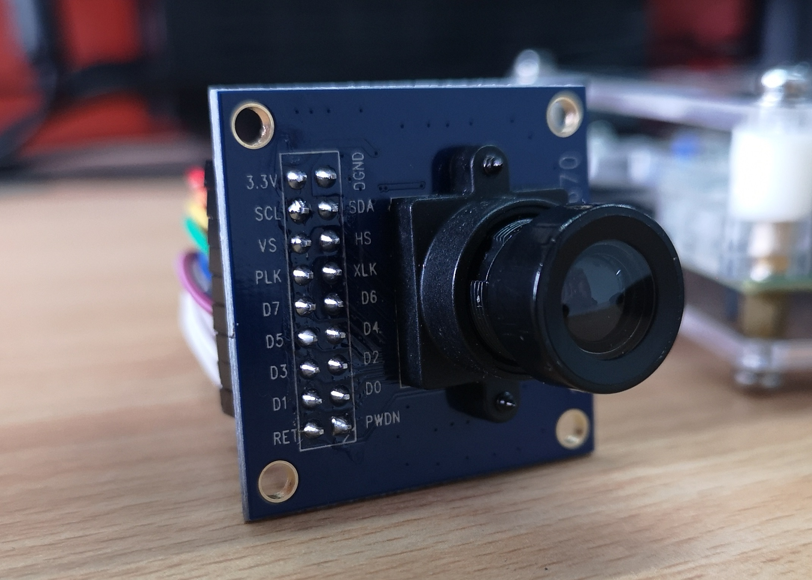
#### OmniVision 串行摄像机控制总线
OmniVision 串行摄像机控制总线 (即 OmniVision Serial Camera Control Bus, 简称SCCB) 是一种专用于控制 OmniVision 摄像机芯片的协议, 它最主要的接口为 `SIO_C` 与 `SIO_D`.

- SCCB_E: 片选信号
- SIO_C: 用以进行芯片的控制
- SIO_D: 用以传输芯片数据
- PWDN: OV 芯片的电源开关

该协议主要依赖于一系列状态转换来完成数据读写.
- Phase 1 -- ID 地址: 设置设备 ID 地址, 其时序图如下:
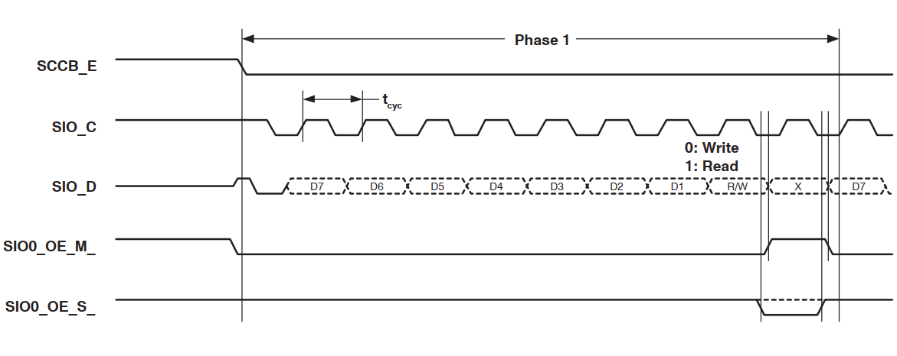
- Phase 2 -- 子地址 / 数据读取: 这个 phase 内可以读取数据, 或者选择子地址以期后续写入.
- Phase 3 -- 写数据: 即写入数据, 最常用于初始化时配置寄存器.

为了完成这一系列操作, 我们代码中的状态机状态主要有这样几个:
```verilog
localparam FSM_IDLE = 0;
localparam FSM_START_SIGNAL = 1;
localparam FSM_LOAD_BYTE = 2;
localparam FSM_TX_BYTE_1 = 3;
localparam FSM_TX_BYTE_2 = 4;
localparam FSM_TX_BYTE_3 = 5;
localparam FSM_TX_BYTE_4 = 6;
localparam FSM_END_SIGNAL_1 = 7;
localparam FSM_END_SIGNAL_2 = 8;
localparam FSM_END_SIGNAL_3 = 9;
localparam FSM_END_SIGNAL_4 = 10;
localparam FSM_DONE = 11;
localparam FSM_TIMER = 12;
```

#### OV7670 摄像机
本款摄像机的结构图如下所示:
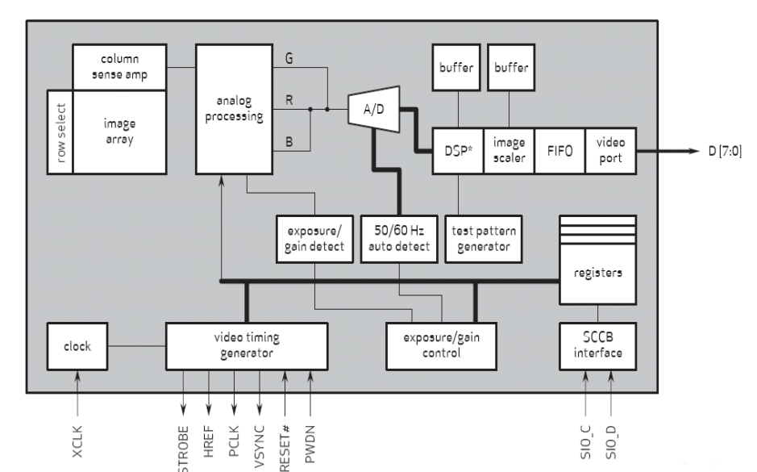
除了电源接口 `3.3V` 和 `GND` 以外, 我们需要控制的接口主要有:
- SCL 和 SDA: 分别对应于上述的 `SIO_C`, `SIO_D`. 此二者只需要按照上述 SCCB 协议的过程进行控制, 一般用于配置芯片寄存器. 
- VS(output): 帧同步信号, 用以读取图片的时候进行同步
- HS(output): 行同步信号, 用以读取图片的时候进行同步
- PLK(output): 像素时钟
- XLK(input): 系统时钟
- D7~D0: 分别是 SCCB 控制协议中的数据位, 共计 1 个字节
- RET: 复位
- PWDN: Power Down, OV 芯片的电源开关

##### 寄存器配置
为了适配我们的实验, 配置 OV7670 的寄存器有一些需要特别注意的地方. 此外的其余配置大多只需要使用常用配置即可.
- MVFP(地址为 1E): 需要配置为水平镜像使能, 以期拍摄书籍等能够显示出正向的图片.
- RGB444(地址为 8C): 虽然该 OV7670 能够提供 RGB565 的更为精确的图像色彩信息, 但由于我们的 Nexys4 DDR 开发板上的 VGA 接口仅能够支持 12 bit 的 RGB444 色彩输出, 因此我们用不上 RGB565, 所以需要使能 OV7670 的 RGB444 采集模式.

要做到配置的更改, 我们需要修改寄存器配置 ROM 模块(`ov7670_config_rom_rgb444.v` 中的 `ov7670_config_rom_rgb444` 模块), 例如下面这句:
```verilog
73: dout <= 16'h8c_02; // RGB444    enable xRGB444
```

#### 视频帧采集
配置好了寄存器以后, 我们需要读取视频帧. OV7670 的视频帧读取非常简单, 每个 PCLK 时钟周期内, 我们都能够先后从 D7~D0 线上读取到像素的 16 个色彩比特. 然后每当读完一组, 我们只要根据手册给出的映射关系(如下图)读取数据就能获取该像素对应的色彩.
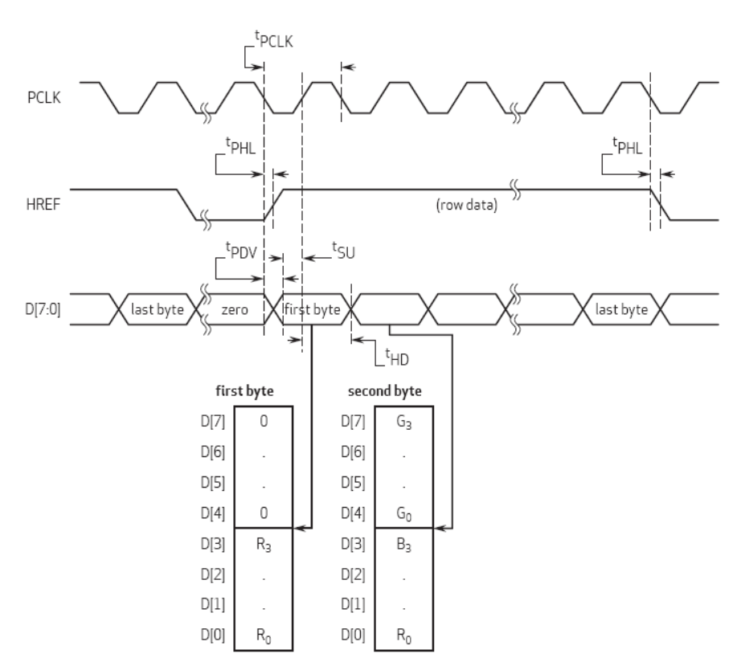
整个视频帧采集的代码中, 最为核心的就是下面这一段. 每当读完整个像素的色彩信息, 就让地址 `address` 自增. 如果在读的只是前一半 (由 `pixel_half` 指示), 则只是单纯地将 `p_data` 写入到 `pixel_data[7:0]`.
```verilog
pixel_half <= ~ pixel_half;
if (pixel_half) pixel_data[7:0] <= p_data;
else begin
    pixel_data[15:8] <= p_data;
    address <= address + 1;
end
```

### 均值滤波 与 中值滤波
二者滤波的主要原理都是以将要计算的像素点为中心, 选取一个卷积核(如 3x3 的卷积核), 并依据卷积核内的其他数据计算出该像素的最终数据.

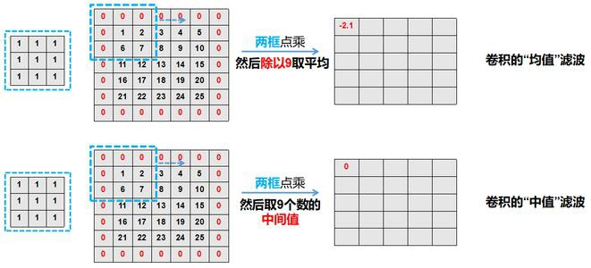

所不同的是, 均值滤波中, 我们可以针对滤波目的来设定卷积核内各个像素点的权重, 而中值滤波则是简单地选取中位数.

#### 均值滤波

在本实验中, 我们选取的均值滤波权重如下:
<table style="vertical-align:middle;">
<tr><td>1</td><td>2</td><td>1</td></tr>
<tr><td>2</td><td>4</td><td>2</td></tr>
<tr><td>1</td><td>2</td><td>1</td></tr>
</table>

之所以选择这样一组数据, 是因为这样能够做到每个数据都能用左移或右移来得到, 而不必做复杂的乘法, 并且最后除以总权重的时候, 也是除以 16, 这只需要右移 4 位, 或者直接取高位就能得到, 这是非常 verilog 友好的写法.

其中最核心的是下面这个代码. 这里 `matrix_??` 是读入的卷积核数据. 至于如何一次性读入处理这 9 个数据, 可参见后文的介绍.
```verilog
stage1_data_r <= 
    (matrix_00[11:8]     ) + (matrix_01[11:8] << 1) + (matrix_02[11:8]     )
    + (matrix_10[11:8] << 1) + (matrix_11[11:8] << 2) + (matrix_12[11:8] << 1)
    + (matrix_20[11:8]     ) + (matrix_21[11:8] << 1) + (matrix_22[11:8]     );

stage1_data_g <= 
    (matrix_00[7:4]     ) + (matrix_01[7:4] << 1) + (matrix_02[7:4]     )
    + (matrix_10[7:4] << 1) + (matrix_11[7:4] << 2) + (matrix_12[7:4] << 1)
    + (matrix_20[7:4]     ) + (matrix_21[7:4] << 1) + (matrix_22[7:4]     );

stage1_data_b <= 
    (matrix_00[3:0]     ) + (matrix_01[3:0] << 1) + (matrix_02[3:0]     )
    + (matrix_10[3:0] << 1) + (matrix_11[3:0] << 2) + (matrix_12[3:0] << 1)
    + (matrix_20[3:0]     ) + (matrix_21[3:0] << 1) + (matrix_22[3:0]     );

stage1_addr <= addr_pixel;
```

#### 中值滤波

中值滤波也是类似的, 但为了在尽量少的时钟周期内获取中位数, 我们需要一个更好的算法. 这里我们参考了论文 [改进中值滤波方法的图像预处理技术](http://www.c-s-a.org.cn/csa/article/pdf/20150542) 提出的方法来求取.

为了方便, 我们利用了 verilog 提供的 `task` 的形式来完成, 这里实现了 `get_max_mid_min`, `get_min`, `get_max`, `get_mid` 四个主要的 `task`, 这很大程度上增强了代码的可读性与易维护性.

在第一个时钟周期, 我们计算每行的 最小值, 最大值 和 中位数:

```verilog
get_max_mid_min(matrix_00[11:8], matrix_01[11:8], matrix_02[11:8], stage1_data_r_maxh0, stage1_data_r_midh0, stage1_data_r_minh0);
get_max_mid_min(matrix_10[11:8], matrix_11[11:8], matrix_12[11:8], stage1_data_r_maxh1, stage1_data_r_midh1, stage1_data_r_minh1);
get_max_mid_min(matrix_20[11:8], matrix_21[11:8], matrix_22[11:8], stage1_data_r_maxh2, stage1_data_r_midh2, stage1_data_r_minh2);
...
stage1_addr <= addr_pixel;
```

第二个时钟周期中, 我们计算上述最大值中的最小值, 最小值中的最大值, 中位数中的中位数:
```verilog
// min of the maxes in each line
get_min(stage1_data_r_maxh0, stage1_data_r_maxh1, stage1_data_r_maxh2, stage2_r_minmax);
...
// mid of the mids in each lin
get_min(stage1_data_r_midh0, stage1_data_r_midh1, stage1_data_r_midh2, stage2_r_midmid);
...
// max of the mins in each line
get_max(stage1_data_r_minh0, stage1_data_r_minh1, stage1_data_r_minh2, stage2_r_maxmin);
...
```
第三个时钟周期中, 我们计算第二步得到的值的中位数, 即为整个卷积核的中位数:
```
// mid of minmax, midmid, maxmin
get_mid(stage2_r_minmax, stage2_r_midmid, stage2_r_maxmin, stage3_data_r);
get_mid(stage2_g_minmax, stage2_g_midmid, stage2_g_maxmin, stage3_data_g);
get_mid(stage2_b_minmax, stage2_b_midmid, stage2_b_maxmin, stage3_data_b);
stage3_addr <= stage2_addr;
```

### 灰度与反灰度
相比于滤波, 灰度与反灰度的处理则相对简单.

著名心理学公式给出, 对人眼而言最为舒适的灰度图满足
```python
Gray = Red * 0.299 + G * 0.587 + B * 0.114
```

理论上, 我们针对每个像素, 按照这个公式进行处理, 就能得到最优的灰度图. 但是对于 FPGA 来说, 过多地使用浮点数乘除法显然会加大它的负担. 鉴于我们的硬件资源限制, 我们原本能够提供的色彩失真也比较大(只有 RGB444 可供使用), 因此我们不必如此精确. 经过各种选择的调试, 最终我们采用的灰度计算公式如下:
```python
Gray = (Red >> 1 + Green * 5 + Blue) >> 3
```
在这个公式下, 我们既可以完成一个比较好的灰度滤镜, 也可以尽可能小地占用硬件资源.

核心代码如下:
```verilog
assign tmp_gray = data[11:8] * 2 + data[7:4] * 5 + data[3:0];
assign gray = 4'hf - tmp_gray[6:3];
assign gray_pixel = {gray, gray, gray};
assign gray_pixel_dark = {tmp_gray[6:3], tmp_gray[6:3], tmp_gray[6:3]};
```
由于逻辑比较简单, 就采用组合电路来完成.

### Sobel算子
Sobel算子通常用于图像的边缘提取。在技术上，它是一离散性差分算子，用来运算图像亮度函数的梯度之近似值。在概念上，Sobel算子就是一个小且是整数的滤波器对整张影像在水平及垂直方向上做卷积，因此它所需的运算资源相对较少，另一方面，对于影像中的频率变化较高的地方，它所得的梯度之近似值也比较粗糙。

由于使用的是FPGA，所以在资源利用率方面要求比较高，所以最终选择了简单且资源占用较少的Sobel算子作为边缘提取的核心。

该算子包含两组3x3的矩阵，分别为横向及纵向。

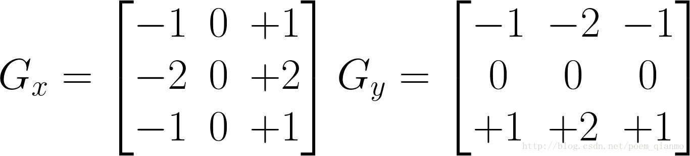

使用一个$3*3$的滑动窗口(关于滑动窗口的实现可参考[滑动窗口](#滑动窗口))，从原始图像中取出$3*3$的图像矩阵$A$并分别与$G_x,G_y$做卷积操作。

$$ A_x = G_x*A \\ A_y=G_y*A$$

> 卷积操作的实现可以参考如下动图
>
> 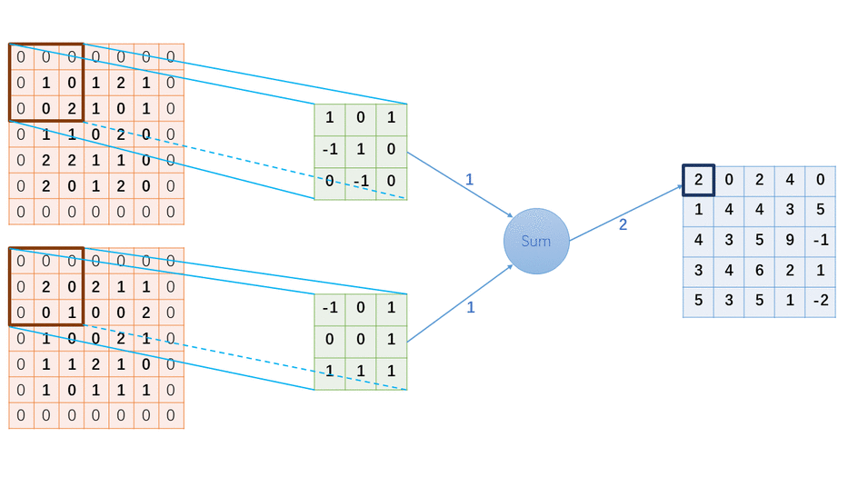

图像的每一个像素的横向及纵向梯度近似值可用以下的公式结合，来计算梯度的大小。

$$G=\sqrt{{A_x}^2+{A_y}^2}$$

由于FPGA的硬件资源有限，所以通常不使用开平方操作，而是使用以下公式近似

$$G=|A_x| + |A_y|$$

最后使用一个阈值来判断该像素位置的值是否为边缘，如果大于该阈值则该像素显示为黑色，否则显示为白色。

```verilog
data_out <= (final_data > threshold[7:0]) ? 12'h000 : 12'hfff;
```

#### 卷积操作的代码实现

由于卷积操作涉及多个数字的相加和相乘，所以为了方式时序问题，我们采用流水线的方式实现卷积操作，第一个时钟周期计算每一行卷积的结果，第二个时钟周期计算每一个卷积核的卷积结果，第三个周期计算两个卷积核的卷积结果的绝对值之和。

```verilog
always@(posedge CLK_100MHZ)
begin
    stage1_data_line1_x <= martix_02[3:0] - martix_00[3:0];
    stage1_data_line2_x <= (martix_12[3:0] - martix_10[3:0]) << 1;
    stage1_data_line3_x <= martix_22[3:0] - martix_20[3:0];
    stage1_data_line1_y <= martix_00[3:0] - martix_20[3:0];
    stage1_data_line2_y <= (martix_01[3:0] - martix_02[3:0]) << 1;
    stage1_data_line3_y <= martix_02[3:0] - martix_22[3:0];

    stage2_data_x <= stage1_data_line1_x + stage1_data_line2_x + stage1_data_line3_x;
    stage2_data_y <= stage1_data_line1_y + stage1_data_line2_y + stage1_data_line3_y;
end

assign final_data = (stage2_data_x > 0 ? stage2_data_x : -stage2_data_x) + 
                    (stage2_data_y > 0 ? stage2_data_y : -stage2_data_y);
```

### 滑动窗口

图片的像素数据被存入一个FIFO，我们只要从FIFO中特定的位置取出像素数据，就可以得到图片中任意位置的像素。

由于Sobel、均值滤波和中值滤波需要使用$3*3$的图像矩阵，所以滑动窗口模块用于每次从图像中取出纵向3个像素的值，通过3个周期的时间，就可以取出一个完整的$3*3$矩阵，如下图所示（下图中它一次性取出连续的3个数据，所以不需要3个周期就可以取出3*3的图像矩阵）。

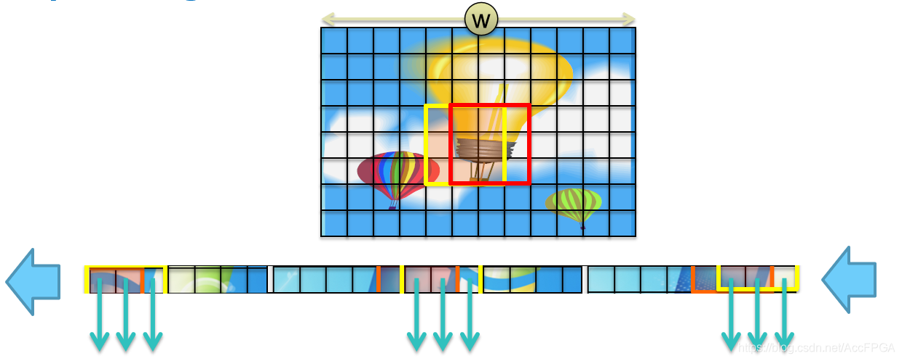

使用Vivado提供的shift ram可以简单的实现滑动窗口。shift ram类似于一个限定了大小的FIFO，通过将3个大小为640的shift ram首尾相接，就可以同时缓存3行的视频像素数据。图解如下：

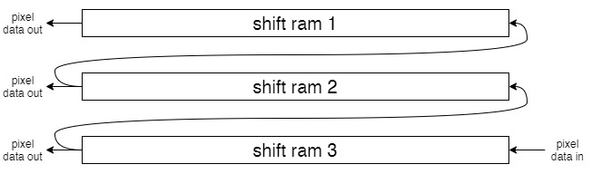

通过每次读取pixel data out[2:0]中的数据，就可以获得一列3个像素的颜色数据，再将其存入一个$3*3$移位寄存器，就可以得到一个$3*3$矩阵。

实现$3*3$矩阵的代码如下

```verilog
always@(posedge valid_pause)
begin
    martix_02 <= line1;
    martix_01 <= martix_02;
    martix_00 <= martix_01;
    martix_12 <= line2;
    martix_11 <= martix_12;
    martix_10 <= martix_11;
    martix_22 <= line3;
    martix_21 <= martix_22;
    martix_20 <= martix_21;
end

// 实现移位寄存器，缓存3行数据，每周期输出一列3个像素数据line1,line2,line3
line_cache(
        .CLK_100MHZ(CLK_100MHZ),
        .RST(RST),
        .valid(valid_pause),
        .data(data),
        .address(addr),
        .line1(line1),
        .line2(line2),
        .line3(line3),
        .addr_out(addr_pixel)
        );
```

### VGA显示
我们使用的是$640*480$ 60fps的VGA显示，该显示格式的VGA时序如下。

| Format        | Pixel Clock (MHz) | Active Video | Front Porch | Sync Pulse | Back Porch | Active Video | Front Porch | Sync Pulse | Back Porch |
| :------------ | :---------------- | :----------- | :---------- | :--------- | :--------- | :----------- | :---------- | ---------- | ---------- |
| 640x480, 60Hz | 25.175            | 640          | 16          | 96         | 48         | 480          | 11          | 2          | 31         |

该模块从一个$640*480$的SRAM中读取像素的颜色信息，并将结果显示到外接的VGA显示器上。

通过VGA模块内部计算得到的当前正在扫描的像素坐标，从SRAM中取出对应像素位置的颜色信息。

模块的使用如下：

```verilog
// VGA control
wire active;
wire [9:0] x;
wire [8:0] y;
vga640x480 display (
    .clk(CLK_100MHZ),// 100Mhz board clock
    .clk_vga(CLK_25MHZ), //25Mhz clock for Pixel Clock
    .rst(RST), 
    .hs(VGA_HS), // H Sync for vga port
    .vs(VGA_VS), // V Sync for vga port
    .x(x), // current display x coordinate on vga monitor
    .y(y), // current display y coordinate on vga monitor
    .active(active) // high when not in blanking interval
); 

always @(posedge CLK_100MHZ)
  begin
    r_addr <= y * 640 + x; // calculate sram address for pixel data
  end

assign {VGA_R, VGA_G, VGA_B} = active ? sram_out : 12'h000; // display color
```

## 效果演示
我们以拍摄`农夫山泉瓶装矿泉水`的结果作为演示.
### 原图像
<table>
    <tr>
        <td><p>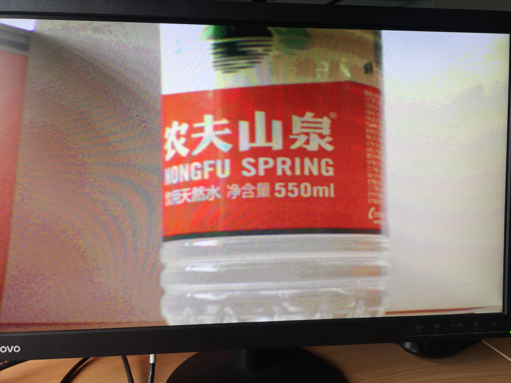</img>原图</p></td>
    </tr>
</table>

### 各层效果
#### 均值滤波 和 中值滤波
<table>
    <tr>
        <td><p>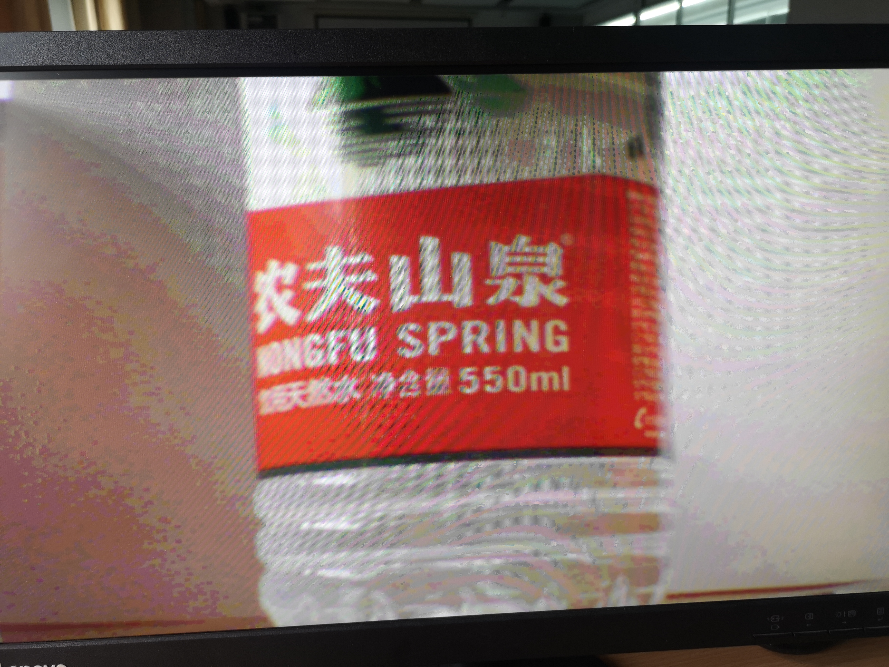</img>均值滤波</p></td>
        <td><p>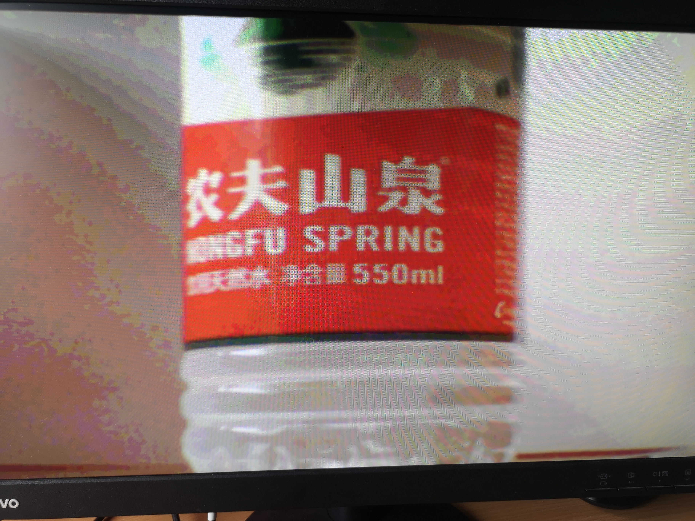</img>中值滤波</p></td>
    </tr>
</table>

#### 灰度化 和 反灰度化
<table>
    <tr>
        <td><p>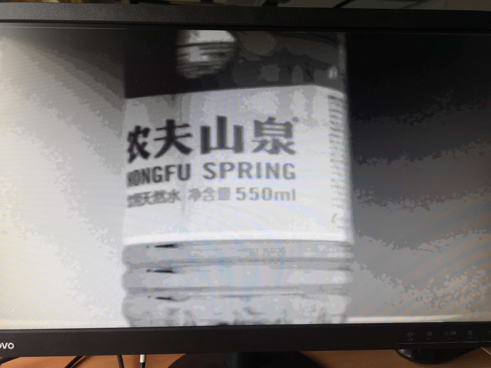</img>反灰度化</p></td>
        <td><p>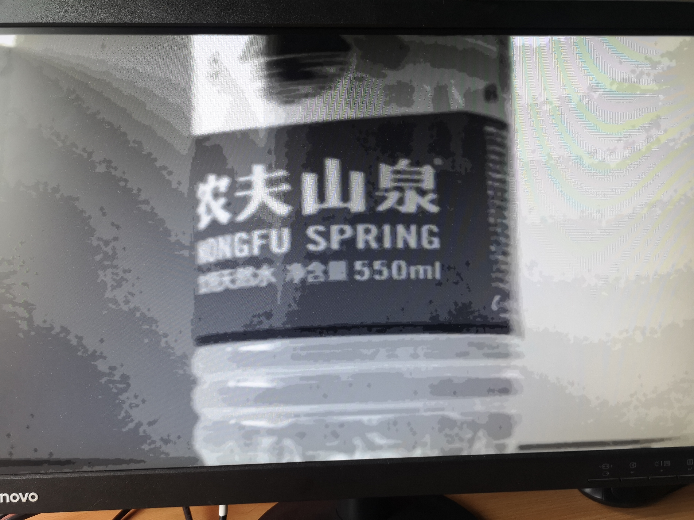</img>灰度化</p></td>
    </tr>
</table>

#### 边缘检测提取
<table>
    <tr>
        <td><p></img>边缘检测提取(threshold=128)</p></td>
    </tr>
</table>


### 不同阈值的结果
另外, 作为对比, 在阈值分别为 128, 32, 8, 2 的情况下, 有下列结果:
<table>
    <tr>
        <td><p></img>threshold=128</p></td>
        <td><p></img>threshold=32</p></td>
    </tr>
    <tr>
        <td><p></img>threshold=8</p></td>
        <td><p>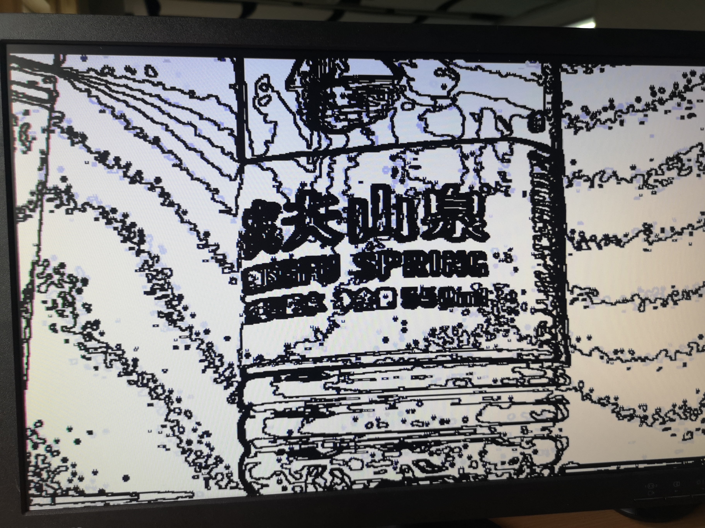</img>threshold=2</p></td>
    </tr>
</table>

## 总结与思考
经过本次实验, 初步了解了图像处理的基础, 学习了均值滤波与中值滤波的卷积方式, 并能够利用一些成熟的公式实现图像灰度化. 此外我们还学会了如何使用 Sobel 算子进行图像的边缘提取. 技术上我们也更加深入地理解了 Verilog 的强大. 最重要的是, 我们对嵌入式系统的设计原理有了更为深刻的理解, 有了流水化的系统结构设计, 我们的所有滤镜算子得以模块化地实现. 总而言之, 我们收获了很多.:smile:
