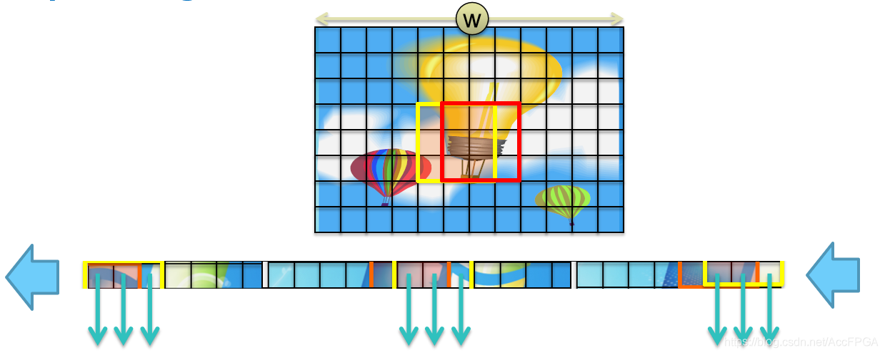

# Realtime-FPGA-Video-Filter

A realtime video filter on FPGA Nexys4.

[TOC]

## 实验简介

本实验作为 `嵌入式系统设计方法` 课程的大作业, 利用了 FPGA 的高并行性质来进行视频流处理, 利用了`均值滤波`, `中值滤波`, `灰度化`(及`反灰度化`)等技术来处理图像, 并最终产生`图像边沿检测`结果.

## 实验环境

- EDA 工具: Vivado 2020.2
- 实验平台: Windows 10
- 实验设备: Nexys 4 DDR xc7a100tcsg324-1 及 OV7670 摄像头

## 工程结构

我们使用了像素流水线的方式组织图像的处理。OV 7670 capture module每次给出一个像素的颜色数据，通过各级流水线的图像处理算法可以对这个像素数据进行一定的处理，并将这个像素数据送入SRAM储存，最终通过VGA显示模块显示在显示器上。通过各级流水线前的MUX，可以很方便地选择数据通过的模块。

通过像素流水线可以最大程度的复用各种模块（例如Sobel模块需要灰度模块的预处理才能使用），这样有利于节约FPGA资源；并且通过像素流水线可以很方便地关闭和使用某个图像处理模块，从而便于对比每个图像处理算法的效果。


## 算法原理及实现

### 摄像头配置
@wzh
### 中值滤波
@wzh
### 均值滤波
@wzh
### 灰度与反灰度
@wzh
### Sobel算子
Sobel算子通常用于图像的边缘提取。在技术上，它是一离散性差分算子，用来运算图像亮度函数的梯度之近似值。在概念上，Sobel算子就是一个小且是整数的滤波器对整张影像在水平及垂直方向上做卷积，因此它所需的运算资源相对较少，另一方面，对于影像中的频率变化较高的地方，它所得的梯度之近似值也比较粗糙。

由于使用的是FPGA，所以在资源利用率方面要求比较高，所以最终选择了简单且资源占用较少的Sobel算子作为边缘提取的核心。

该算子包含两组3x3的矩阵，分别为横向及纵向。


使用一个$3*3$的滑动窗口(关于滑动窗口的实现可参考[滑动窗口](#滑动窗口))，从原始图像中取出$3*3$的图像矩阵$A$并分别与$G_x,G_y$做卷积操作。

$$ A_x = G_x*A \\ A_y=G_y*A$$

> 卷积操作的实现可以参考如下动图
>
> 

图像的每一个像素的横向及纵向梯度近似值可用以下的公式结合，来计算梯度的大小。

$$G=\sqrt{{A_x}^2+{A_y}^2}$$

由于FPGA的硬件资源有限，所以通常不使用开平方操作，而是使用以下公式近似

$$G=|A_x| + |A_y|$$

最后使用一个阈值来判断该像素位置的值是否为边缘，如果大于该阈值则该像素显示为黑色，否则显示为白色。

```verilog
data_out <= (final_data > threshold[7:0]) ? 12'h000 : 12'hfff;
```

#### 卷积操作的代码实现

由于卷积操作涉及多个数字的相加和相乘，所以为了方式时序问题，我们采用流水线的方式实现卷积操作，第一个时钟周期计算每一行卷积的结果，第二个时钟周期计算每一个卷积核的卷积结果，第三个周期计算两个卷积核的卷积结果的绝对值之和。

```verilog
always@(posedge CLK_100MHZ)
begin
    stage1_data_line1_x <= martix_02[3:0] - martix_00[3:0];
    stage1_data_line2_x <= (martix_12[3:0] - martix_10[3:0]) << 1;
    stage1_data_line3_x <= martix_22[3:0] - martix_20[3:0];
    stage1_data_line1_y <= martix_00[3:0] - martix_20[3:0];
    stage1_data_line2_y <= (martix_01[3:0] - martix_02[3:0]) << 1;
    stage1_data_line3_y <= martix_02[3:0] - martix_22[3:0];

    stage2_data_x <= stage1_data_line1_x + stage1_data_line2_x + stage1_data_line3_x;
    stage2_data_y <= stage1_data_line1_y + stage1_data_line2_y + stage1_data_line3_y;
end

assign final_data = (stage2_data_x > 0 ? stage2_data_x : -stage2_data_x) + 
                    (stage2_data_y > 0 ? stage2_data_y : -stage2_data_y);
```

### 滑动窗口

图片的像素数据被存入一个FIFO，我们只要从FIFO中特定的位置取出像素数据，就可以得到图片中任意位置的像素。

由于Sobel、均值滤波和中值滤波需要使用$3*3$的图像矩阵，所以滑动窗口模块用于每次从图像中取出纵向3个像素的值，通过3个周期的时间，就可以取出一个完整的$3*3$矩阵，如下图所示（下图中它一次性取出连续的3个数据，所以不需要3个周期就可以取出3*3的图像矩阵）。



使用Vivado提供的shift ram可以简单的实现滑动窗口。shift ram类似于一个限定了大小的FIFO，通过将3个大小为640的shift ram首尾相接，就可以同时缓存3行的视频像素数据。图解如下：


通过每次读取pixel data out[2:0]中的数据，就可以获得一列3个像素的颜色数据，再将其存入一个$3*3$移位寄存器，就可以得到一个$3*3$矩阵。

实现$3*3$矩阵的代码如下

```verilog
always@(posedge valid_pause)
begin
    martix_02 <= line1;
    martix_01 <= martix_02;
    martix_00 <= martix_01;
    martix_12 <= line2;
    martix_11 <= martix_12;
    martix_10 <= martix_11;
    martix_22 <= line3;
    martix_21 <= martix_22;
    martix_20 <= martix_21;
end

// 实现移位寄存器，缓存3行数据，每周期输出一列3个像素数据line1,line2,line3
line_cache(
        .CLK_100MHZ(CLK_100MHZ),
        .RST(RST),
        .valid(valid_pause),
        .data(data),
        .address(addr),
        .line1(line1),
        .line2(line2),
        .line3(line3),
        .addr_out(addr_pixel)
        );
```

### VGA显示
我们使用的是$640*480$ 60fps的VGA显示，该显示格式的VGA时序如下。

| Format        | Pixel Clock (MHz) | Active Video | Front Porch | Sync Pulse | Back Porch | Active Video | Front Porch | Sync Pulse | Back Porch |
| :------------ | :---------------- | :----------- | :---------- | :--------- | :--------- | :----------- | :---------- | ---------- | ---------- |
| 640x480, 60Hz | 25.175            | 640          | 16          | 96         | 48         | 480          | 11          | 2          | 31         |

该模块从一个$640*480$的SRAM中读取像素的颜色信息，并将结果显示到外接的VGA显示器上。

通过VGA模块内部计算得到的当前正在扫描的像素坐标，从SRAM中取出对应像素位置的颜色信息。

模块的使用如下：

```verilog
// VGA control
wire active;
wire [9:0] x;
wire [8:0] y;
vga640x480 display (
    .clk(CLK_100MHZ),// 100Mhz board clock
    .clk_vga(CLK_25MHZ), //25Mhz clock for Pixel Clock
    .rst(RST), 
    .hs(VGA_HS), // H Sync for vga port
    .vs(VGA_VS), // V Sync for vga port
    .x(x), // current display x coordinate on vga monitor
    .y(y), // current display y coordinate on vga monitor
    .active(active) // high when not in blanking interval
); 

always @(posedge CLK_100MHZ)
  begin
    r_addr <= y * 640 + x; // calculate sram address for pixel data
  end

assign {VGA_R, VGA_G, VGA_B} = active ? sram_out : 12'h000; // display color
```

## 效果演示

### 均值滤波
图
### 中值滤波
图
### 灰度化
图
### 反灰度化
图
### 图像边缘检测
图
#### 不同阈值的结果
放一组图

## 总结与思考
